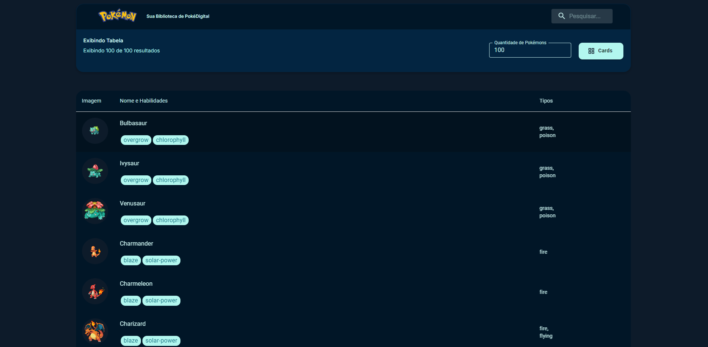

# Projeto: Lista de Pokémons




## Descrição
Este é um projeto desenvolvido em React utilizando a biblioteca Material-UI (MUI) para construir uma interface moderna e responsiva. A aplicação exibe uma lista de Pokémons, permitindo visualizar suas informações em dois formatos: cards e tabela. Além disso, o projeto inclui funcionalidades de busca e controle do número de Pokémons exibidos entre outras funcionalidades. Veja abaixo:

## Funcionalidades
- Alternar entre visualizações de **cards** e **tabela**.
- Filtrar Pokémons por nome.
- Configurar a quantidade de Pokémons exibidos.
- Exibir informações detalhadas dos Pokémons, como tipos, habilidades e imagem.
- Pesquisa por comando (Ctrl + /) ou (Cmd + /)
- Navegação pelas teclas Arrow Up e Arrow Down

## Tecnologias Utilizadas
- **React**: Framework JavaScript para construir interfaces de usuário.
- **Material-UI (MUI)**: Biblioteca de componentes para estilização e design responsivo.
- **Axios**: Para realizar requisições à API de Pokémons.

## Estrutura do Projeto
A organização do código segue boas práticas de separação de responsabilidades:

```
src/
|-- components/
|   |-- NavBar/
|   |-- Buttons/
|   |-- PokemonCard/
|   |-- PokemonTable/
|   |-- TextFields/
|
|-- services/
|   |-- pokemonService.js
|
|-- pages/
|   |-- Home.jsx
|
|-- App.js
|-- index.css
|-- index.js
```

### Descrição dos Principais Arquivos
- **Home.js**: Componente principal onde a lista de Pokémons é renderizada, junto com a barra de navegação e opções de visualização.
- **NavBar**: Componente responsável pela barra de navegação, incluindo o campo de busca.
- **PokemonCard.js**: Renderiza as informações do Pokémon em formato de card. (extra que fiz)
- **PokemonTable.js**: Exibe os Pokémons em formato de tabela.
- **pokemonService.js**: Gerencia as requisições à API para obter os dados dos Pokémons.

## Instalação e Execução
### Pré-requisitos
- Node.js instalado na máquina.
- Gerenciador de pacotes **npm** ou **yarn**.

### Passos para Instalação

### Instalando Material-UI e Ícones
1. Instale a biblioteca Material-UI:
   ```bash
   npm install @mui/material @emotion/react @emotion/styled
   # ou
   yarn add @mui/material @emotion/react @emotion/styled
   ```

2. Instale os ícones do Material-UI:
   ```bash
   npm install @mui/icons-material
   # ou
   yarn add @mui/icons-material
   ```
1. Clone o repositório:
   ```bash
   git clone https://github.com/ricardo006/pokedigital.git
   ```
2. Navegue até o diretório do projeto:
   ```bash
   cd pokedigital
   ```
3. Instale as dependências:
   ```bash
   npm install
   # ou
   yarn install
   ```

### Executando a Aplicação
1. Inicie o servidor de desenvolvimento:
   ```bash
   npm start
   # ou
   yarn start
   ```
2. Acesse a aplicação no navegador em [http://localhost:3000](http://localhost:3000).

## Uso
1. Utilize a barra de busca para filtrar os Pokémons pelo nome.
2. Alterne entre os modos de visualização (cards ou tabela) utilizando o botão de alternância.
3. Configure a quantidade de Pokémons a serem exibidos na interface.


## Licença
Este projeto é licenciado sob a [MIT License](LICENSE).

## Contato
Caso tenha dúvidas ou sugestões, entre em contato:
- Nome: [Seu Nome]
- Email: [Seu Email]
- LinkedIn: [Seu Perfil no LinkedIn]

